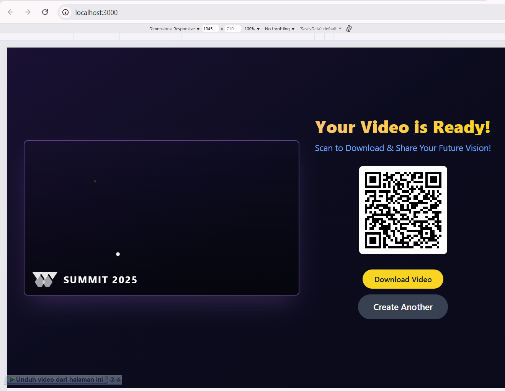

Document already loaded, running initialization immediately
content-script.js:4 Attempting to initialize AdUnit
content-script.js:6 AdUnit initialized successfully
StyledPreviewScreen.tsx:84 Tombol 'Create Motion Portrait' diklik
2ProcessingScreen.tsx:33 Memulai proses generateMotionVideo di ProcessingScreen
geminiService.ts:77 Video generation started, operation: models/veo-2.0-generate-001/operations/b4m4stoxx4iz
geminiService.ts:81 Polling for video generation status...
geminiService.ts:77 Video generation started, operation: models/veo-2.0-generate-001/operations/j2s7af5ysw8h
7geminiService.ts:81 Polling for video generation status...
geminiService.ts:86 Operation response: Object
geminiService.ts:87 Generated videos: Array(1)
geminiService.ts:95 Download link received: https://generativelanguage.googleapis.com/v1beta/files/igpjjqa6jeat:download?alt=media
geminiService.ts:86 Operation response: Object
geminiService.ts:87 Generated videos: Array(1)
geminiService.ts:95 Download link received: https://generativelanguage.googleapis.com/v1beta/files/gwq4uwmcjqvz:download?alt=media
App.tsx:63 handleProcessingComplete dipanggil, videoUrl: blob:http://localhost:3000/4360e16e-1671-48f4-b121-43e1f052f016
geminiService.ts:118 Memulai upload video ke server, URL: blob:http://localhost:3000/4360e16e-1671-48f4-b121-43e1f052f016
geminiService.ts:122 Response fetch video: true 200
geminiService.ts:127 Blob size: 2926580 type: video/mp4
App.tsx:63 handleProcessingComplete dipanggil, videoUrl: blob:http://localhost:3000/0900f5b2-6467-4851-943c-a25f6b0097b9
geminiService.ts:118 Memulai upload video ke server, URL: blob:http://localhost:3000/0900f5b2-6467-4851-943c-a25f6b0097b9
geminiService.ts:122 Response fetch video: true 200
geminiService.ts:127 Blob size: 2872949 type: video/mp4
geminiService.ts:139 Upload response: 200 true
geminiService.ts:147 Upload result: Object
App.tsx:72 Upload ke server berhasil, serverVideoUrl: /uploads/videos/58ef7c87-b43c-497e-a50b-4d1966915b5c_1759918790759.mp4
geminiService.ts:139 Upload response: 200 true
geminiService.ts:147 Upload result: Object
App.tsx:72 Upload ke server berhasil, serverVideoUrl: /uploads/videos/322b325e-c202-4103-82a0-b659a2063d27_1759918790820.mp4

 ini di resultnya videonya ga muncul
